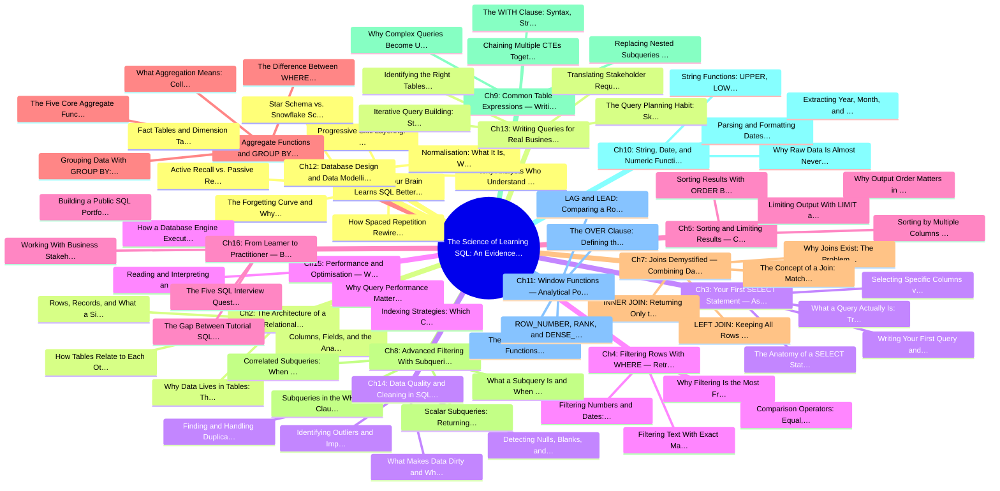

# Book Structure — Mind Map

> Paste the code block below into any Mermaid renderer:
> [mermaid.live](https://mermaid.live) · GitHub Markdown · Notion · Obsidian · VS Code (Mermaid Preview extension)

## Chapter Overview

**1. Why Your Brain Learns SQL Better With a System — The Cognitive Science Behind Technical Skill Acquisition**

   - The Forgetting Curve and Why Most SQL Tutorials Fail You
   - How Spaced Repetition Rewires Technical Memory
   - Active Recall vs. Passive Reading: What the Research Says
   - Progressive Skill Layering: Building SQL Knowledge Like a Pyramid

**2. The Architecture of a Relational Database — Tables, Rows, Columns, and the Logic Behind the Structure**

   - Why Data Lives in Tables: The Filing Cabinet Analogy
   - Rows, Records, and What a Single Unit of Data Actually Means
   - Columns, Fields, and the Anatomy of a Data Type
   - How Tables Relate to Each Other: The Core Idea Behind Relational Databases

**3. Your First SELECT Statement — Asking Questions of a Database in Plain English**

   - What a Query Actually Is: Translating Business Questions Into SQL
   - The Anatomy of a SELECT Statement: Keywords, Clauses, and Syntax Rules
   - Selecting Specific Columns vs. Selecting Everything With the Asterisk
   - Writing Your First Query and Reading the Output Table
   - Aliasing Columns: Giving Your Results Readable Names With AS
   - Eliminating Duplicates With DISTINCT

**4. Filtering Rows With WHERE — Retrieving Only the Data You Actually Need**

   - Why Filtering Is the Most Frequently Used Skill in Real Analyst Work
   - Comparison Operators: Equal, Not Equal, Greater Than, Less Than
   - Filtering Text With Exact Matches and Case Sensitivity Traps
   - Filtering Numbers and Dates: Ranges, Boundaries, and Edge Cases
   - Combining Conditions With AND, OR, and NOT
   - Pattern Matching With LIKE and Wildcard Characters

**5. Sorting and Limiting Results — Controlling What You See and in What Order**

   - Why Output Order Matters in Business Reporting
   - Sorting Results With ORDER BY: Ascending and Descending Logic
   - Sorting by Multiple Columns and Understanding Sort Priority
   - Limiting Output With LIMIT and OFFSET for Pagination
   - Combining WHERE and ORDER BY in a Single Query
   - The Logical Order of SQL Clauses vs. the Written Order: A Critical Distinction
   - Practical Exercise: Building a Top-Ten Customer Report From Scratch
   - Chapter Review: Key Terms, Active Recall Questions, and Mini-Challenge

**6. Aggregate Functions and GROUP BY — Turning Raw Rows Into Business Insights**

   - What Aggregation Means: Collapsing Many Rows Into One Meaningful Number
   - The Five Core Aggregate Functions: COUNT, SUM, AVG, MIN, MAX
   - Grouping Data With GROUP BY: Segmenting Results by Category
   - The Difference Between WHERE and HAVING: Filtering Before and After Aggregation
   - Counting Nulls vs. Counting Values: A Trap Every Beginner Falls Into
   - Combining Aggregates With Aliases for Readable Analytical Output
   - Real-World Exercise: Monthly Revenue Summary by Product Category
   - Chapter Review: Key Terms, Active Recall Questions, and Mini-Challenge

**7. Joins Demystified — Combining Data From Multiple Tables Without Losing Your Mind**

   - Why Joins Exist: The Problem With Storing Everything in One Table
   - The Concept of a Join: Matching Rows Across Tables on a Shared Key
   - INNER JOIN: Returning Only the Rows That Match on Both Sides
   - LEFT JOIN: Keeping All Rows From the Left Table Regardless of Matches
   - RIGHT JOIN and FULL OUTER JOIN: Completing the Picture
   - Joining More Than Two Tables: Chaining Joins in a Single Query

**8. Advanced Filtering With Subqueries — Queries Inside Queries**

   - What a Subquery Is and When You Need One Instead of a Join
   - Scalar Subqueries: Returning a Single Value to Filter Against
   - Subqueries in the WHERE Clause With IN and NOT IN
   - Correlated Subqueries: When the Inner Query References the Outer Query
   - Subqueries in the FROM Clause: Creating Temporary Derived Tables
   - Performance Intuition: When Subqueries Slow Things Down and Why
   - Real-World Exercise: Finding Customers Who Have Never Placed an Order
   - Chapter Review: Key Terms, Active Recall Questions, and Mini-Challenge

**9. Common Table Expressions — Writing SQL That Humans Can Actually Read**

   - Why Complex Queries Become Unreadable and What CTEs Solve
   - The WITH Clause: Syntax, Structure, and How the Database Processes It
   - Replacing Nested Subqueries With Named CTEs for Clarity
   - Chaining Multiple CTEs Together in a Single Query
   - Recursive CTEs: Traversing Hierarchical Data Like Org Charts and Categories
   - CTEs vs. Subqueries vs. Temporary Tables: Choosing the Right Tool
   - Real-World Exercise: Multi-Step Sales Funnel Analysis Using Chained CTEs
   - Chapter Review: Key Terms, Active Recall Questions, and Mini-Challenge

**10. String, Date, and Numeric Functions — Cleaning and Transforming Real-World Data**

   - Why Raw Data Is Almost Never Analysis-Ready
   - String Functions: UPPER, LOWER, TRIM, CONCAT, SUBSTRING, and REPLACE
   - Parsing and Formatting Dates With DATEPART, DATEADD, and DATEDIFF
   - Extracting Year, Month, and Day for Time-Series Grouping
   - Numeric Functions: ROUND, FLOOR, CEILING, ABS, and CAST
   - Using CASE WHEN to Create Conditional Columns and Buckets
   - Real-World Exercise: Standardising a Messy Customer Name and Date Dataset
   - Chapter Review: Key Terms, Active Recall Questions, and Mini-Challenge

**11. Window Functions — Analytical Power Without Collapsing Your Rows**

   - The Problem Window Functions Solve That GROUP BY Cannot
   - The OVER Clause: Defining the Window Frame Your Calculation Runs Across
   - ROW_NUMBER, RANK, and DENSE_RANK: Ranking Rows Within Groups
   - LAG and LEAD: Comparing a Row to the Row Before or After It
   - Running Totals and Moving Averages With SUM and AVG Over a Window
   - PARTITION BY vs. GROUP BY: Understanding the Critical Difference

**12. Database Design and Data Modelling — Understanding the Structure Behind the Queries You Write**

   - Why Analysts Who Understand Schema Design Write Better Queries
   - Normalisation: What It Is, Why It Matters, and the Three Normal Forms
   - Star Schema vs. Snowflake Schema: The Data Warehouse Structures You Will Actually Query
   - Fact Tables and Dimension Tables: The Building Blocks of Analytical Databases
   - Indexes: What They Are and Why They Make Queries Fast or Slow
   - Reading Production Database Documentation and Data Dictionaries
   - Designing a Simple Schema From a Business Requirement: A Worked Example
   - Chapter Review: Key Terms, Active Recall Questions, and Mini-Challenge

**13. Writing Queries for Real Business Questions — From Vague Request to Executable SQL**

   - Translating Stakeholder Requests Into Precise Analytical Questions
   - The Query Planning Habit: Sketching Logic Before Writing a Single Line of Code
   - Identifying the Right Tables, Keys, and Joins Before Opening a Query Editor
   - Iterative Query Building: Starting Small and Adding Complexity Gradually
   - Validating Your Results: Sanity-Checking Outputs Against Known Benchmarks
   - Documenting Queries With Comments for Collaboration and Reproducibility

**14. Data Quality and Cleaning in SQL — Identifying and Fixing Dirty Data at the Source**

   - What Makes Data Dirty and Why It Silently Corrupts Analysis
   - Detecting Nulls, Blanks, and Placeholder Values Across a Dataset
   - Finding and Handling Duplicates With ROW_NUMBER and Deduplication Queries
   - Identifying Outliers and Impossible Values With Statistical Filters
   - Standardising Inconsistent Categories Using CASE WHEN and String Functions
   - Auditing Referential Integrity: Orphaned Records and Broken Foreign Keys

**15. Performance and Optimisation — Writing SQL That Doesn't Bring a Database to Its Knees**

   - Why Query Performance Matters Beyond Just Getting the Right Answer
   - How a Database Engine Executes a Query: The Logical Processing Order
   - Reading and Interpreting an Execution Plan Without Being a DBA
   - Indexing Strategies: Which Columns to Index and Which to Leave Alone

**16. From Learner to Practitioner — Building a Portfolio, Passing Interviews, and Working With Data Professionally**

   - The Gap Between Tutorial SQL and Production SQL: What Changes on the Job
   - Building a Public SQL Portfolio With Real Datasets and Documented Analysis
   - The Five SQL Interview Question Types and How to Approach Each One
   - Working With Business Stakeholders: Asking the Right Clarifying Questions

